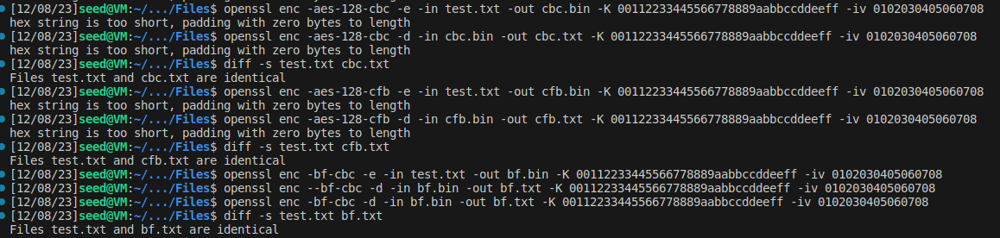
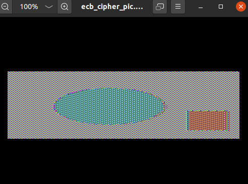
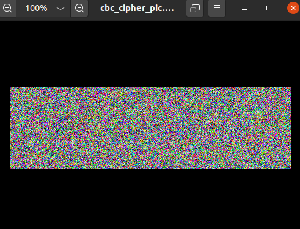
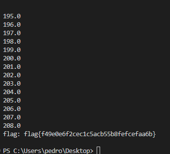

## Secret Key Encryption Vulnerability Lab

## Task1

Nesta tarefa foi-nos fornecido um texto cifrado codificado usando a substituição de letras. O objetivo era decifrar esse texto e descobrir o original.
Iniciamos executando o script em python fornecido, "freq.py", que indica a frequência de uso das letras no texto cifrado. Esse script revela as três letras mais frequentemente usadas em conjunto, as duas letras mais frequentes em conjunto e as letras individuais mais frequentes. 
Em seguida, com base nessas informações, começamos a decifrar o texto usando um processo de dedução. Utilizamos também um recurso auxiliar,  o site 'https://www.merriam-webster.com/wordfinder/classic/begins/common/3/t/1'. Este site permite pesquisar as palavras mais comuns de acordo com diferentes critérios, como o tamanho da palavra, letras iniciais e/ou finais.
Utilizando a frequência das letras e a dedução lógica, deciframos o texto letra por letra. Por exemplo, sabendo que a palavra mais comum de três letras em inglês é "the", substituímos a sequência criptografada mais frequente de três letras no texto e, consequentemente, as letras correspondentes onde essas letras apareciam no texto. Isso ajudou-nos a deduzir mais letras e, quando necessário, utilizamos o site para validar nossas suposições.
Para substituir uma letra por outra, utilizamos o comando 'tr'. O comando final usado para substituir as letras cifradas pelas letras reais foi o seguinte:
```bash
tr ’ytnhvupqzxadmlbregijcfsokw’ ’THERANDSUOCYIWFGPBLQMVKJXZ’ < ciphertext.txt > test.txt
```

E este foi o texto decifrado:

THE OSCARS TURN  ON SUNDAY WHICH SEEMS ABOUT RIGHT AFTER THIS LONG STRANGE
AWARDS TRIP THE BAGGER FEELS LIKE A NONAGENARIAN TOO

THE AWARDS RACE WAS BOOKENDED BY THE DEMISE OF HARVEY WEINSTEIN AT ITS OUTSET
AND THE APPARENT IMPLOSION OF HIS FILM COMPANY AT THE END AND IT WAS SHAPED BY
THE EMERGENCE OF METOO TIMES UP BLACKGOWN POLITICS ARMCANDY ACTIVISM AND
A NATIONAL CONVERSATION AS BRIEF AND MAD AS A FEVER DREAM ABOUT WHETHER THERE
OUGHT TO BE A PRESIDENT WINFREY THE SEASON DIDNT JUST SEEM EXTRA LONG IT WAS
EXTRA LONG BECAUSE THE OSCARS WERE MOVED TO THE FIRST WEEKEND IN MARCH TO
AVOID CONFLICTING WITH THE CLOSING CEREMONY OF THE WINTER OLYMPICS THANKS
PYEONGCHANG

ONE BIG QUESTION SURROUNDING THIS YEARS ACADEMY AWARDS IS HOW OR IF THE
CEREMONY WILL ADDRESS METOO ESPECIALLY AFTER THE GOLDEN GLOBES WHICH BECAME
A JUBILANT COMINGOUT PARTY FOR TIMES UP THE MOVEMENT SPEARHEADED BY 
POWERFUL HOLLYWOOD WOMEN WHO HELPED RAISE MILLIONS OF DOLLARS TO FIGHT SEXUAL
HARASSMENT AROUND THE COUNTRY

SIGNALING THEIR SUPPORT GOLDEN GLOBES ATTENDEES SWATHED THEMSELVES IN BLACK
SPORTED LAPEL PINS AND SOUNDED OFF ABOUT SEXIST POWER IMBALANCES FROM THE RED
CARPET AND THE STAGE ON THE AIR E WAS CALLED OUT ABOUT PAY INEQUITY AFTER
ITS FORMER ANCHOR CATT SADLER QUIT ONCE SHE LEARNED THAT SHE WAS MAKING FAR
LESS THAN A MALE COHOST AND DURING THE CEREMONY NATALIE PORTMAN TOOK A BLUNT
AND SATISFYING DIG AT THE ALLMALE ROSTER OF NOMINATED DIRECTORS HOW COULD
THAT BE TOPPED

AS IT TURNS OUT AT LEAST IN TERMS OF THE OSCARS IT PROBABLY WONT BE

WOMEN INVOLVED IN TIMES UP SAID THAT ALTHOUGH THE GLOBES SIGNIFIED THE
INITIATIVES LAUNCH THEY NEVER INTENDED IT TO BE JUST AN AWARDS SEASON
CAMPAIGN OR ONE THAT BECAME ASSOCIATED ONLY WITH REDCARPET ACTIONS INSTEAD
A SPOKESWOMAN SAID THE GROUP IS WORKING BEHIND CLOSED DOORS AND HAS SINCE
AMASSED  MILLION FOR ITS LEGAL DEFENSE FUND WHICH AFTER THE GLOBES WAS
FLOODED WITH THOUSANDS OF DONATIONS OF  OR LESS FROM PEOPLE IN SOME 
COUNTRIES


NO CALL TO WEAR BLACK GOWNS WENT OUT IN ADVANCE OF THE OSCARS THOUGH THE
MOVEMENT WILL ALMOST CERTAINLY BE REFERENCED BEFORE AND DURING THE CEREMONY 
ESPECIALLY SINCE VOCAL METOO SUPPORTERS LIKE ASHLEY JUDD LAURA DERN AND
NICOLE KIDMAN ARE SCHEDULED PRESENTERS

ANOTHER FEATURE OF THIS SEASON NO ONE REALLY KNOWS WHO IS GOING TO WIN BEST
PICTURE ARGUABLY THIS HAPPENS A LOT OF THE TIME INARGUABLY THE NAILBITER
NARRATIVE ONLY SERVES THE AWARDS HYPE MACHINE BUT OFTEN THE PEOPLE FORECASTING
THE RACE SOCALLED OSCAROLOGISTS CAN MAKE ONLY EDUCATED GUESSES

THE WAY THE ACADEMY TABULATES THE BIG WINNER DOESNT HELP IN EVERY OTHER
CATEGORY THE NOMINEE WITH THE MOST VOTES WINS BUT IN THE BEST PICTURE
CATEGORY VOTERS ARE ASKED TO LIST THEIR TOP MOVIES IN PREFERENTIAL ORDER IF A
MOVIE GETS MORE THAN  PERCENT OF THE FIRSTPLACE VOTES IT WINS WHEN NO
MOVIE MANAGES THAT THE ONE WITH THE FEWEST FIRSTPLACE VOTES IS ELIMINATED AND
ITS VOTES ARE REDISTRIBUTED TO THE MOVIES THAT GARNERED THE ELIMINATED BALLOTS
SECONDPLACE VOTES AND THIS CONTINUES UNTIL A WINNER EMERGES

IT IS ALL TERRIBLY CONFUSING BUT APPARENTLY THE CONSENSUS FAVORITE COMES OUT
AHEAD IN THE END THIS MEANS THAT ENDOFSEASON AWARDS CHATTER INVARIABLY
INVOLVES TORTURED SPECULATION ABOUT WHICH FILM WOULD MOST LIKELY BE VOTERS
SECOND OR THIRD FAVORITE AND THEN EQUALLY TORTURED CONCLUSIONS ABOUT WHICH
FILM MIGHT PREVAIL

IN  IT WAS A TOSSUP BETWEEN BOYHOOD AND THE EVENTUAL WINNER BIRDMAN
IN  WITH LOTS OF EXPERTS BETTING ON THE REVENANT OR THE BIG SHORT THE
PRIZE WENT TO SPOTLIGHT LAST YEAR NEARLY ALL THE FORECASTERS DECLARED LA
LA LAND THE PRESUMPTIVE WINNER AND FOR TWO AND A HALF MINUTES THEY WERE
CORRECT BEFORE AN ENVELOPE SNAFU WAS REVEALED AND THE RIGHTFUL WINNER
MOONLIGHT WAS CROWNED

THIS YEAR AWARDS WATCHERS ARE UNEQUALLY DIVIDED BETWEEN THREE BILLBOARDS
OUTSIDE EBBING MISSOURI THE FAVORITE AND THE SHAPE OF WATER WHICH IS
THE BAGGERS PREDICTION WITH A FEW FORECASTING A HAIL MARY WIN FOR GET OUT

BUT ALL OF THOSE FILMS HAVE HISTORICAL OSCARVOTING PATTERNS AGAINST THEM THE
SHAPE OF WATER HAS  NOMINATIONS MORE THAN ANY OTHER FILM AND WAS ALSO
NAMED THE YEARS BEST BY THE PRODUCERS AND DIRECTORS GUILDS YET IT WAS NOT
NOMINATED FOR A SCREEN ACTORS GUILD AWARD FOR BEST ENSEMBLE AND NO FILM HAS
WON BEST PICTURE WITHOUT PREVIOUSLY LANDING AT LEAST THE ACTORS NOMINATION
SINCE BRAVEHEART IN  THIS YEAR THE BEST ENSEMBLE SAG ENDED UP GOING TO
THREE BILLBOARDS WHICH IS SIGNIFICANT BECAUSE ACTORS MAKE UP THE ACADEMYS
LARGEST BRANCH THAT FILM WHILE DIVISIVE ALSO WON THE BEST DRAMA GOLDEN GLOBE
AND THE BAFTA BUT ITS FILMMAKER MARTIN MCDONAGH WAS NOT NOMINATED FOR BEST
DIRECTOR AND APART FROM ARGO MOVIES THAT LAND BEST PICTURE WITHOUT ALSO
EARNING BEST DIRECTOR NOMINATIONS ARE FEW AND FAR BETWEEN

## Task2

Nesta tarefa foi pedido que experimentássemos 3 cifras diferentes, utilizando o "comando openssl enc" para criptografar e descriptografar ficheiros. Por sugestão do enunciado, usamos os seguintes modos: -aes-128-cbc,-bf-cbc,-aes-128-cfb. Para demonstrar esses modos, utilizamos o texto decifrado na tarefa anterior, test.txt e o criptografamos e descriptografamos três vezes usando os modos acima mencionados. Os comandos utilizados estão listados abaixo (o comando diff foi usado para garantir que os ficheiros eram iguais):

```bash
openssl enc -aes-128-cbc -e -in test.txt -out cbc.bin -K 00112233445566778889aabbccddeeff -iv 0102030405060708

openssl enc -aes-128-cbc -d -in cbc.bin -out cbc.txt -K 00112233445566778889aabbccddeeff -iv 0102030405060708

diff -s test.txt cbc.txt

openssl enc -aes-128-cfb -e -in test.txt -out cfb.bin -K 00112233445566778889aabbccddeeff -iv 0102030405060708

openssl enc -aes-128-cfb -d -in cfb.bin -out cfb.txt -K 00112233445566778889aabbccddeeff -iv 0102030405060708 

diff -s test.txt cfb.txt

openssl enc -bf-cbc -e -in test.txt -out bf.bin -K 00112233445566778889aabbccddeeff -iv 0102030405060708

openssl enc -bf-cbc -d -in bf.bin -out bf.txt -K 00112233445566778889aabbccddeeff -iv 0102030405060708

diff -s test.txt bf.txt
```
Resultados:



## Task3

Nesta tarefa, foi-nos fornecida uma imagem para criptografar utilizando os modos Electronic Code Book (ECB) e Cipher Block Chaining (CBC). Utilizamos os seguintes comandos:

```bash
openssl enc -aes-128-cbc -e -in pic_original.bmp -out cbc_cipher_pic.bmp -K 00112233445566778889aabbccddeeff -iv 0102030405060708

openssl enc -aes-128-ecb -e -in pic_original.bmp -out ecb_cipher_pic.bmp -K 00112233445566778889aabbccddeeff 
```
De seguida executamos os comandos recomendados pelo enunciado para manipular e combinar seções específicas das imagens criptografadas. O comando head foi usado para copiar o cabeçalho inicial da imagem original, enquanto os comandos tail foram usados para capturar o restante das imagens criptografadas. Em seguida, o comando cat foi usado para juntar o cabeçalho e o corpo da imagem criptografada resultante.

```bash
head -c 54 pic_original.bmp > header 
tail -c +55 cbc_cipher_pic.bmp > body_cbc 
tail -c +55 ecb_cipher_pic.bmp > body_ecb 
cat header body_cbc > cbc_cipher_pic.bmp 
cat header body_ecb > ecb_cipher_pic.bmp
```

Após criar as imagens criptografadas ('cbc_cipher_pic.bmp' e 'ecb_cipher_pic.bmp'), examinamos-as para verificar se havia diferenças. No modo ECB, ainda conseguimos identificar as formas dos objetos, enquanto no modo CBC, não é possível identificar qualquer objeto ou forma.

ECB:



CBC:



# CTF - Weak-Encryption (Normal)

## Descrição
Analisando o código fornecido no ficheiro cipherspec.py, com uma função de geração de chaves para um algoritmo AES-CTR, foi possível identificar uma vulnerabilidade: esta chave gerada contém sempre 3 bytes nulos ('\x00') e o resto é preenchido aleatoriamente.
Desta forma, usando uma abordagem brute-force, conseguimos tentar adivinhar a chave e decifrar a mensagem.
Esta mensagem é acedida através de <code>nc ctf-fsi.fe.up.pt 6003</code>, juntamente com o nonce.

```py
from cryptography.hazmat.primitives.ciphers import Cipher, algorithms, modes
from cryptography.hazmat.backends import default_backend
import os
from binascii import hexlify, unhexlify

KEYLEN = 16

def gen():
    offset = 3
    key = bytearray(b'\x00' * (KEYLEN - offset))
    key.extend(os.urandom(offset))
    return bytes(key)

def enc(k, m, nonce):
    cipher = Cipher(algorithms.AES(k), modes.CTR(nonce), backend=default_backend())
    encryptor = cipher.encryptor()
    cph = b""
    cph += encryptor.update(m)
    cph += encryptor.finalize()
    return cph

def dec(k, c, nonce):
    cipher = Cipher(algorithms.AES(k), modes.CTR(nonce), backend=default_backend())
    decryptor = cipher.decryptor()
    msg = b""
    msg += decryptor.update(c)
    msg += decryptor.finalize()
    return msg
```

## Exploit
Esta abordagem, ainda que com tempo de execução elevado, permite-nos conseguir encontrar a flag.
Decidimos também dar print da variável *i* usada no loop, que irá de 0 a 255, para ter uma noção do progresso do exploit.

```py
hex_nonce = "2860e189232a92a0057367257992887e"
hex_ciphertext = "119b25dc02fdbd1ecb7892d8cd95ea3bf9a0e52fc3d894aeaab3d5b5c961f288b9cfd4685dc2e5"  

nonce = bytes.fromhex(hex_nonce)
ciphertext = bytes.fromhex(hex_ciphertext)

for i in range(256**3):
    key = bytearray(b'\x00' * 13) + i.to_bytes(3, 'big')
    if(int(i/256/256) == i/256/256):
        print(i/256/256)
    message = dec(bytes(key), ciphertext, nonce)
    if message.startswith(b'flag{'):
        print('flag: ' + message.decode())
        break
```

## Flag encontrada
Executando o exploit, encontraremos a flag, neste caso após a função percorrer 81.5% das possibilidades.


