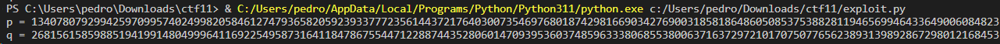

# Public-Key Infrastructure Lab

## Task 1

O objetivo da primeira tarefa é tornarmo-nos CA (Certificate Authority). Para isto, copiamos o ficheiro `openssl.conf` para a pasta onde estamos a trabalhar e alteramos algumas definições do mesmo:<br>
```bash
[ CA_default ]
dir = ./demoCA                # Where everything is kept
certs = $dir/certs            # Where the issued certs are kept
crl_dir = $dir/crl            # Where the issued crl are kept
database = $dir/index.txt     # database index file.
unique_subject = no           # Set to ’no’ to allow creation of
# several certs with same subject.
new_certs_dir = $dir/newcerts # default place for new certs.
serial = $dir/serial          # The current serial number
```
<br>

De seguida, criamos um `index.txt` vazio e um ficheiro `serial` onde simplesmente colocamos o número 1000, como string.<br>

Para gerar o certificado *self-assigned*, corremos o comando:<br> 
```bash
openssl req -x509 -newkey rsa:4096 -sha256 -days 3650 \
-keyout ca.key -out ca.crt
```
<br>

Para vermos o conteúdo do certificado X509 e da chave RSA, basta correr os seguintes comandos:<br>
```bash
openssl x509 -in ca.crt -text -noout
openssl rsa -in ca.key -text -noout
```
(onde -text transforma o código em *plain text* e -noout não dá print à versão codificada).<br>

Como é possível ver na imagem abaixo, o certificado trata-se de um CA uma vez que `CA:TRUE`.


# Task 2

Nesta task, temos de gerar um certificado para um próprio servidor web (`bank32.com`). Para isto geramos utilizando o seguinte comando:
```bash
openssl req -newkey rsa:2048 -sha256 \
-keyout server.key -out server.csr \
-subj "/CN=www.bank32.com/O=Bank32 Inc./C=US" \
-passout pass:dees
```
<br>
E, com os seguinte comandos, visualizamos o conteúdo do CSR:<br>
`openssl req -in server.csr -text -noout` <br>
`openssl rsa -in server.key -text -noout` <br>

<br>

# Task 3

Nesta task, vamos utilizar um comando que transforma o CSR num certificado X509, utilizando `ca.crt` e `ca.key` da CA. Para isto, bastou correr o comando:
```bash
openssl ca -config myCA_openssl.cnf -policy policy_anything \
-md sha256 -days 3650 \
-in server.csr -out server.crt -batch \
-cert ca.crt -keyfile ca.key
```
<br>

Isto vai criar um `server.crt`, criado atra´ves do `server.csr`.<br>
Após isto, corremos o comando `openssl x509 -in server.crt -text -noout` e verificamos que os nomes alternativos estavam, de facto, incluídos.


# Task 4

Nesta tarefa, dentro do nosso container temos a seguinte entrada:
```bash
<VirtualHost *:443>
    DocumentRoot /var/www/bank32
    ServerName www.bank32.com
    ServerAlias www.bank32A.com
    ServerAlias www.bank32B.com
    DirectoryIndex index.html
    SSLEngine On
    SSLCertificateFile /certs/bank32.crt
    SSLCertificateKeyFile /certs/bank32.key
</VirtualHost>
```
<br>

Demos build e executamos o código deste mesmo container e, de seguida, executamos os seguintes comandos:<br>
```bash
# a2enmod ssl // Enable the SSL module
# a2ensite bank32_apache_ssl // Enable the sites described in this file
```
<br>

Estes servem para ativar o módulo Apache ssl e ativar o site, respetivamente.<br>
Para iniciar o servidor Apache inserimos o comando `# service apache2 start`.
<br><br>

Acedemos ao site, no entanto a nossa conexão não estava encriptada. Para contrariar isto, carregamos o certificado CA gerado anteriormente no browser, e contornamos a stiuação.


# Task 5

O objetivo desta tarefa é lançar um Man-In-The-Middle Attack, e mostar que uma PKI pode impedir estes mesmos ataques.<br>

Utilizamos o mesmo servidor Apache  e alteramos a sua configuração para o site `www.example.com`.<br>
Após isto, mudamos a entrada do `/etc/hosts` para `10.9.0.80 www.example.com` e ao abrir o servidor, o browser mostrou-nos `Warning: Potential Security Risk Ahead`.


Isto por causa do certificado que usamos para o `www.bank32.com`.

# Task 6

Nesta tarefa, geramos um novo CA uma vez que, o CA utilizado anteriormente foi comprometido. Para isto temos de criar um novo certificado mas desta vez com foco no site `www.example.com`. Então, simplesmente repetimos a Task 2, utilizando os comandos:<br>
```bash
$ openssl req -newkey rsa:2048 -sha256 -keyout example.key -out example.csr -subj "/CN=www.example.com/O=example Inc./C=US" -passout pass:1234
$ openssl ca -config openssl.cnf -policy policy_anything -md sha256 -days 3650 -in example.csr -out example.crt -batch -cert ca.crt -keyfile ca.key
```

<br><br>

Assim tornou-se possível aceder ao site sem nos avisarem de nenhum `Warning`.


# CTF Semana #11 - (RSA)

## Descrição 

No CTF desta semana, foi-nos dado acesso a um servidor, na porta 6004 de ctf-fsi.fe.up.pt que nos fornece a flag que foi cifrada usando RSA, juntamente com o módulo utilizado (n) e o expoente público (e).
Este algoritmo, à partida, dificilmente possibilitará que se consiga adivinhar o conjunto de primos que foi usado para gerar o módulo, mas é-nos dado o conhecimento que `p é um primo próximo de 2^512` e `q é um primo próximo de 2^513`.
Para conseguirmos descobrir os números primos, foi-nos sugerido que utilizássemos o algoritmo de Miller-Rabin.

## Resolução do problema

```py
# Primality Testing with the Rabin-Miller Algorithm
# http://inventwithpython.com/hacking (BSD Licensed)

import random


def rabinMiller(num):
    # Returns True if num is a prime number.

    s = num - 1
    t = 0
    while s % 2 == 0:
        # keep halving s while it is even (and use t
        # to count how many times we halve s)
        s = s // 2
        t += 1

    for trials in range(5): # try to falsify num's primality 5 times
        a = random.randrange(2, num - 1)
        v = pow(a, s, num)
        if v != 1: # this test does not apply if v is 1.
            i = 0
            while v != (num - 1):
                if i == t - 1:
                    return False
                else:
                    i = i + 1
                    v = (v ** 2) % num
    return True


def isPrime(num):
    # Return True if num is a prime number. This function does a quicker
    # prime number check before calling rabinMiller().

    if (num < 2):
        return False # 0, 1, and negative numbers are not prime

    # About 1/3 of the time we can quickly determine if num is not prime
    # by dividing by the first few dozen prime numbers. This is quicker
    # than rabinMiller(), but unlike rabinMiller() is not guaranteed to
    # prove that a number is prime.
    lowPrimes = [2, 3, 5, 7, 11, 13, 17, 19, 23, 29, 31, 37, 41, 43, 47, 53, 59, 61, 67, 71, 73, 79, 83, 89, 97, 101, 103, 107, 109, 113, 127, 131, 137, 139, 149, 151, 157, 163, 167, 173, 179, 181, 191, 193, 197, 199, 211, 223, 227, 229, 233, 239, 241, 251, 257, 263, 269, 271, 277, 281, 283, 293, 307, 311, 313, 317, 331, 337, 347, 349, 353, 359, 367, 373, 379, 383, 389, 397, 401, 409, 419, 421, 431, 433, 439, 443, 449, 457, 461, 463, 467, 479, 487, 491, 499, 503, 509, 521, 523, 541, 547, 557, 563, 569, 571, 577, 587, 593, 599, 601, 607, 613, 617, 619, 631, 641, 643, 647, 653, 659, 661, 673, 677, 683, 691, 701, 709, 719, 727, 733, 739, 743, 751, 757, 761, 769, 773, 787, 797, 809, 811, 821, 823, 827, 829, 839, 853, 857, 859, 863, 877, 881, 883, 887, 907, 911, 919, 929, 937, 941, 947, 953, 967, 971, 977, 983, 991, 997]

    if num in lowPrimes:
        return True

    # See if any of the low prime numbers can divide num
    for prime in lowPrimes:
        if (num % prime == 0):
            return False

    # If all else fails, call rabinMiller() to determine if num is a prime.
    return rabinMiller(num)


def generateLargePrime(keysize=1024):
    # Return a random prime number of keysize bits in size.
    while True:
        num = random.randrange(2**(keysize-1), 2**(keysize))
        if isPrime(num):
            return num
```

Através desta implementação do algoritmo de Miller-Rabin, encontrada em <a href="https://inventwithpython.com/rabinMiller.py">https://inventwithpython.com/rabinMiller.py</a>, conseguiremos encontrá-los.

Definimos um intervalo de teste de 15000, para evitar que o código tenha um tempo de execução demasiado elevado, e usaremos os valores fornecidos pelo servidor.

```py
n = 359538626972463181545861038157804946723595395788461314546860162315465351611001926265416954644815072042240227759742786715317579537628833244985694861278971243146135638403756740005476362228600815351288481858812807445552284189996501896013041435503010713705189426005962420057108679785981920977128846367293882688819

i = 15000
p = (2**512 + 1) - i
while p < 2**512 + i:
        if isPrime(p):
                q, rem = divmod(n, p)
                if rem == 0 and isPrime(q):
                        print(f"p = {p}")
                        print(f"q = {q}")
        p += 2

```



Encontrámos os primos para utilizar.

Agora, usando estes mesmos, já temos todos os parâmetros necessários para decifrar a flag.

Usando a função `dec()` que nos foi fornecida, chegaremos assim à flag, e o CTF dá-se por concluído.
 
```py
p = 13407807929942597099574024998205846127479365820592393377723561443721764030073546976801874298166903427690031858186486050853753882811946569946433649006084823
q = 26815615859885194199148049996411692254958731641184786755447122887443528060147093953603748596333806855380063716372972101707507765623893139892867298012168453

e = 65537 
n = 359538626972463181545861038157804946723595395788461314546860162315465351611001926265416954644815072042240227759742786715317579537628833244985694861278971243146135638403756740005476362228600815351288481858812807445552284189996501896013041435503010713705189426005962420057108679785981920977128846367293882688819

ciphertext = "3337666263306432643434623730346365363163376639616338656630306436626330343065643239306136383766386631333066363434653337663539303064323034376461353437373165343433333265303363633561613630346536616533356636343663643066663630656431393964346238346264353065336163613763303035663865353430656633646337326237353362646631653566326165643334326233333861396564373064393931376365396630643066633265633762316436626636373763646461323633303837343166396361393161303965626265633862383663316132326237333434663139393635323838613861646630313030303030303030303030303030303030303030303030303030303030303030303030303030303030303030303030303030303030303030303030303030303030303030303030303030303030303030303030303030303030303030303030303030303030303030303030303030303030303030303030303030303030303030303030303030303030303030303030303030303030303030303030303030303030303030303030303030303030303030303030303030303030303030303030303030303030303030303030303030303030303030303030303030303030303030303030303030303030303030303030303030303030303030303030303030"

phi = (p-1)*(q-1)
d = pow(e, -1, phi)
flag = dec(unhexlify(ciphertext), d, n)
print(flag.decode())  
```

