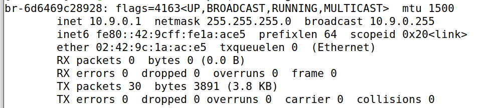
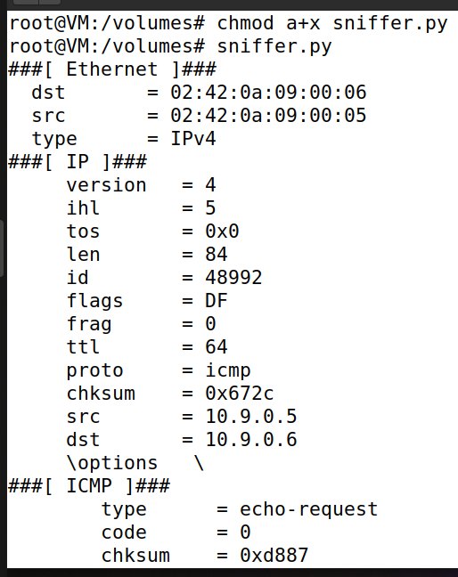
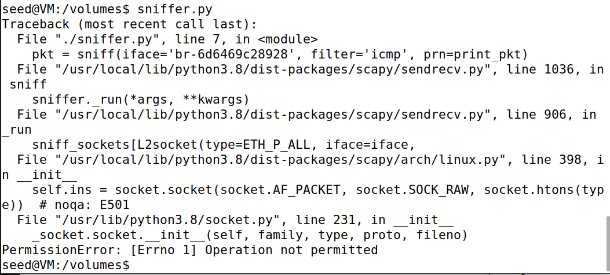
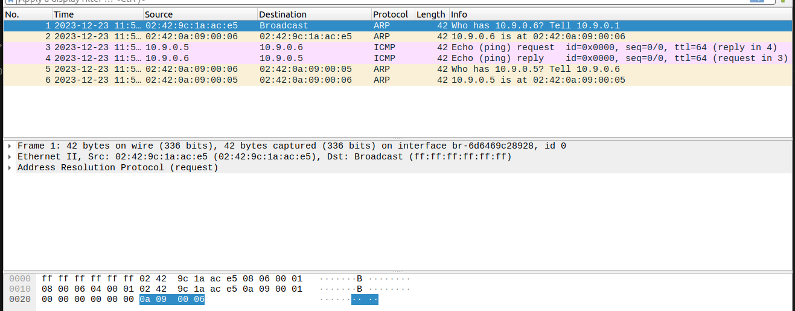

# Packet Sniffing and Spoofing Lab

## Environment Setup

Para dar setup a este lab, utilizamos os comandos `dcbuild` e `dcup` e, com isto, os containers vão estar a correr no background.
```bash
$ dockps
b988de0884dd  hostB-10.9.0.6
5e6588a7dd2d  seed-attacker
fbf9780bdc05  hostA-10.9.0.5
```

Para correr comandos num container, basta correr o comando `$ docksh <id>`, id cujo valor obtemos com o comando `dockps`, como mostrado acima.<br>
Depois de dar setup aos containers, corremos o comando `ifconfig`. Neste caso, o endereço de IP relacionado com a VM é 10.9.0.1.



A interface vai ser então `br-6d6469c28928`.

## Task 1.1

A nossa primeira tarefa foi dar sniff aos pacotes na nossa interface. Para isso foi necessário criar um programa em Python com o código fornecido no lab.

```py
#!/usr/bin/env python3
from scapy.all import *

def print_pkt(pkt):
    pkt.show()
    
pkt = sniff(iface='br-6d6469c28928', filter='icmp', prn=print_pkt)
```

### 1.1A

Nesta tarefa tivemos de executar o programa com privilégio de root e demonstrar que podemos realmente capturar pacotes, através do comando `chmod a+x sniffer.py`. Depois disso, executamos o programa novamente, mas sem usar o privilégio de root, utilizando o comando `su seed`. <br><br>

Para testarmos este código, através do hostA, demos ping ao hostB. Os resultados foram os seguintes:

| Com root privilege | Sem root privilege |
|--------------------|--------------------|
|  |  |


### 1.1B

De seguida, tivemos de alterar o código para que fosse possível capturar apenas pacotes específicos. Para isso tivemos de filtrar os pacotes a que demos sniff.

* **Capture only the ICMP packet**

Para esta primeira captura alteramos o parâmetro `filter` no `sniffer.py` para ficar do seguinte modo:

```py
#!/usr/bin/env python3
from scapy.all import *

def print_pkt(pkt):
    pkt.show()
    
pkt = sniff(iface='br-6d6469c28928', filter='icmp', prn=print_pkt)
```

Os resultados foram os seguintes:
```bash
###[ Ethernet ]### 
  dst       = 02:42:0a:09:00:06
  src       = 02:42:0a:09:00:05
  type      = IPv4
###[ IP ]### 
     version   = 4
     ihl       = 5
     tos       = 0x0
     len       = 84
     id        = 48947
     flags     = DF
     frag      = 0
     ttl       = 64
     proto     = icmp
     chksum    = 0x6759
     src       = 10.9.0.5
     dst       = 10.9.0.6
     \options   \
###[ ICMP ]### 
        type      = echo-request
        code      = 0
        chksum    = 0xa67f
        id        = 0x29
        seq       = 0x3
###[ Raw ]### 
           load      = '\x83\x04\x87e\x00\x00\x00\x00y\x17\x0f\x00\x00\x00\x00\x00\x10\x11\x12\x13\x14\x15\x16\x17\x18\x19\x1a\x1b\x1c\x1d\x1e\x1f !"#$%&\()*+,-./01234567'

###[ Ethernet ]### 
  dst       = 02:42:0a:09:00:05
  src       = 02:42:0a:09:00:06
  type      = IPv4
###[ IP ]### 
     version   = 4
     ihl       = 5
     tos       = 0x0
     len       = 84
     id        = 2064
     flags     = 
     frag      = 0
     ttl       = 64
     proto     = icmp
     chksum    = 0x5e7d
     src       = 10.9.0.6
     dst       = 10.9.0.5
     \options   \
###[ ICMP ]### 
        type      = echo-reply
        code      = 0
        chksum    = 0xae7f
        id        = 0x29
        seq       = 0x3
###[ Raw ]### 
           load      = '\x83\x04\x87e\x00\x00\x00\x00y\x17\x0f\x00\x00\x00\x00\x00\x10\x11\x12\x13\x14\x15\x16\x17\x18\x19\x1a\x1b\x1c\x1d\x1e\x1f !"#$%&\'()*+,-./01234567'

```

* **Capture any TCP packet that comes from a particular IP and with a destination port number 23**

Para esta captura alteramos o parâmetro `filter` no `sniffer.py` para ficar do seguinte modo:

```py
#!/usr/bin/env python3
from scapy.all import *

def print_pkt(pkt):
    pkt.show()
    

pkt = sniff(iface='br-6d6469c28928', filter='tcp and src host 10.9.0.5 and dst port 23', prn=print_pkt)
```

Demos run ao código python e, de seguida, corremos o comando `$ echo "Hello World!" > /dev/tcp/10.9.0.6/23` e os resultados foram os seguintes:

```bash
###[ Ethernet ]### 
  dst       = 02:42:0a:09:00:06
  src       = 02:42:0a:09:00:05
  type      = IPv4
###[ IP ]### 
     version   = 4
     ihl       = 5
     tos       = 0x0
     len       = 60
     id        = 64796
     flags     = DF
     frag      = 0
     ttl       = 64
     proto     = tcp
     chksum    = 0x2983
     src       = 10.9.0.5
     dst       = 10.9.0.6
     \options   \
###[ TCP ]### 
        sport     = 58608
        dport     = telnet
        seq       = 3987082348
        ack       = 0
        dataofs   = 10
        reserved  = 0
        flags     = S
        window    = 64240
        chksum    = 0x144b
        urgptr    = 0
        options   = [('MSS', 1460), ('SAckOK', b''), ('Timestamp', (2062405737, 0)), ('NOP', None), ('WScale', 7)]

###[ Ethernet ]### 
  dst       = 02:42:0a:09:00:06
  src       = 02:42:0a:09:00:05
  type      = IPv4
###[ IP ]### 
     version   = 4
     ihl       = 5
     tos       = 0x0
     len       = 52
     id        = 64797
     flags     = DF
     frag      = 0
     ttl       = 64
     proto     = tcp
     chksum    = 0x298a
     src       = 10.9.0.5
     dst       = 10.9.0.6
     \options   \
###[ TCP ]### 
        sport     = 58608
        dport     = telnet
        seq       = 3987082349
        ack       = 3494265462
        dataofs   = 8
        reserved  = 0
        flags     = A
        window    = 502
        chksum    = 0x1443
        urgptr    = 0
        options   = [('NOP', None), ('NOP', None), ('Timestamp', (2062405738, 3397722347))]

###[ Ethernet ]### 
  dst       = 02:42:0a:09:00:06
  src       = 02:42:0a:09:00:05
  type      = IPv4
###[ IP ]### 
     version   = 4
     ihl       = 5
     tos       = 0x0
     len       = 65
     id        = 64798
     flags     = DF
     frag      = 0
     ttl       = 64
     proto     = tcp
     chksum    = 0x297c
     src       = 10.9.0.5
     dst       = 10.9.0.6
     \options   \
###[ TCP ]### 
        sport     = 58608
        dport     = telnet
        seq       = 3987082349
        ack       = 3494265462
        dataofs   = 8
        reserved  = 0
        flags     = PA
        window    = 502
        chksum    = 0x1450
        urgptr    = 0
        options   = [('NOP', None), ('NOP', None), ('Timestamp', (2062405738, 3397722347))]
###[ Raw ]### 
           load      = 'Hello World!\n'

###[ Ethernet ]### 
  dst       = 02:42:0a:09:00:06
  src       = 02:42:0a:09:00:05
  type      = IPv4
###[ IP ]### 
     version   = 4
     ihl       = 5
     tos       = 0x0
     len       = 52
     id        = 64799
     flags     = DF
     frag      = 0
     ttl       = 64
     proto     = tcp
     chksum    = 0x2988
     src       = 10.9.0.5
     dst       = 10.9.0.6
     \options   \
###[ TCP ]### 
        sport     = 58608
        dport     = telnet
        seq       = 3987082362
        ack       = 3494265462
        dataofs   = 8
        reserved  = 0
        flags     = FA
        window    = 502
        chksum    = 0x1443
        urgptr    = 0
        options   = [('NOP', None), ('NOP', None), ('Timestamp', (2062405738, 3397722347))]

###[ Ethernet ]### 
  dst       = 02:42:0a:09:00:06
  src       = 02:42:0a:09:00:05
  type      = IPv4
###[ IP ]### 
     version   = 4
     ihl       = 5
     tos       = 0x10
     len       = 40
     id        = 0
     flags     = DF
     frag      = 0
     ttl       = 64
     proto     = tcp
     chksum    = 0x26a4
     src       = 10.9.0.5
     dst       = 10.9.0.6
     \options   \
###[ TCP ]### 
        sport     = 58608
        dport     = telnet
        seq       = 3987082363
        ack       = 0
        dataofs   = 5
        reserved  = 0
        flags     = R
        window    = 0
        chksum    = 0xbc9a
        urgptr    = 0
        options   = []
```

* **Capture  packets  comes  from  or  to  go  to  a  particular  subnet**

Para esta captura alteramos o parâmetro `filter` no `sniffer.py` para ficar do seguinte modo:

```py
#!/usr/bin/env python3
from scapy.all import *

def print_pkt(pkt):
    pkt.show()

pkt = sniff(iface='br-6d6469c28928', filter='net 128.230.0.0/16', prn=print_pkt)
```

Corremos o comando `$ ping 128.230.0.0` para dar ping ao endereço correto e demos run ao código python. Os resultados foram os seguintes:


```bash
###[ Ethernet ]### 
  dst       = 02:42:0a:09:00:06
  src       = 02:42:0a:09:00:05
  type      = IPv4
###[ IP ]### 
     version   = 4
     ihl       = 5
     tos       = 0x0
     len       = 84
     id        = 51701
     flags     = DF
     frag      = 0
     ttl       = 64
     proto     = icmp
     chksum    = 0x5c97
     src       = 10.9.0.5
     dst       = 10.9.0.6
     \options   \
###[ ICMP ]### 
        type      = echo-request
        code      = 0
        chksum    = 0x2b3c
        id        = 0x26
        seq       = 0x5
###[ Raw ]### 
           load      = '_\xf4\x86e\x00\x00\x00\x00&l\x01\x00\x00\x00\x00\x00\x10\x11\x12\x13\x14\x15\x16\x17\x18\x19\x1a\x1b\x1c\x1d\x1e\x1f !"#$%&\()*+,-./01234567'

###[ Ethernet ]### 
  dst       = 02:42:0a:09:00:05
  src       = 02:42:0a:09:00:06
  type      = IPv4
###[ IP ]### 
     version   = 4
     ihl       = 5
     tos       = 0x0
     len       = 84
     id        = 5847
     flags     = 
     frag      = 0
     ttl       = 64
     proto     = icmp
     chksum    = 0x4fb6
     src       = 10.9.0.6
     dst       = 10.9.0.5
     \options   \
###[ ICMP ]### 
        type      = echo-reply
        code      = 0
        chksum    = 0x333c
        id        = 0x26
        seq       = 0x5
###[ Raw ]### 
           load      = '_\xf4\x86e\x00\x00\x00\x00&l\x01\x00\x00\x00\x00\x00\x10\x11\x12\x13\x14\x15\x16\x17\x18\x19\x1a\x1b\x1c\x1d\x1e\x1f !"#$%&\()*+,-./01234567'

###[ Ethernet ]### 
  dst       = 02:42:0a:09:00:06
  src       = 02:42:0a:09:00:05
  type      = IPv4
###[ IP ]### 
     version   = 4
     ihl       = 5
     tos       = 0x0
     len       = 84
     id        = 51712
     flags     = DF
     frag      = 0
     ttl       = 64
     proto     = icmp
     chksum    = 0x5c8c
     src       = 10.9.0.5
     dst       = 10.9.0.6
     \options   \
###[ ICMP ]### 
        type      = echo-request
        code      = 0
        chksum    = 0x91dd
        id        = 0x26
        seq       = 0x6
###[ Raw ]### 
           load      = '`\xf4\x86e\x00\x00\x00\x00\xbe\xc9\x01\x00\x00\x00\x00\x00\x10\x11\x12\x13\x14\x15\x16\x17\x18\x19\x1a\x1b\x1c\x1d\x1e\x1f !"#$%&\()*+,-./01234567'
```

## Task 1.2

A próxima tarefa tinha um objetivo muito específico: usar o Scapy para falsificar pacotes ICMP com um endereço IP de origem arbitrário.<br><br>

Para isso, criamos um código python `spoofer.py` cuja função foi a pedida para esta tarefa.

```py
from scapy.all import IP, ICMP, send

ip = IP()

ip.src = '10.9.0.5' # host A
ip.dst = '10.9.0.6' # host B

packet = ip/ICMP()

send(packet)
```

Usamos o Wireshark para observar se nossa solicitação foi aceite ou não. Neste caso, com as linhas 3 e 4, conseguimos concluir que o mesmo foi aceite.



## Task 1.3

Nesta tarefa tivemos de implementar uma versão nossa de uma `traceroute` usando o `Scapy`.<br>
Durante a implementação do mesmo tivemos de ter em conta os seguintes pontos:<br>
* Criar um endereço IP cujo destino é o pretendido e o seu valor TTL é 1.
* Gerar um loop infinito cujo propósito é incrementar o TTL e criar um pacote para ser enviado.
* Enviar o pacote e receber o primeiro que é enviado como `reply`.
* Verificar que a mensagem de erro ICMP é recebida. Se for, incrementar o TTL e tentar novamente.
* Dar print ao valor final do TTL (**distância**).

<br>
Tendo isto em conta, o código final ficou:

```py
from scapy.all import IP, ICMP, sr1, send

a = IP()
a.dst = '8.8.8.8'
a.ttl = 1
b = ICMP()

keepSending = True
while keepSending:
    receivedPacket = sr1(a/b, timeout=1, verbose=0)

    if (receivedPacket == None) or (receivedPacket[ICMP].type == 11 and receivedPacket[ICMP].code == 0):
        try:
            print(f"Step {a.tll} -> Router IP: {receivedPacket[IP].src}\n")
        except:
            print(f"Step {a.ttl}, unknown IP")
        a.ttl += 1
        continue
    else:
        keepSending = False

print(f"Distance: {a.ttl}\n")
```