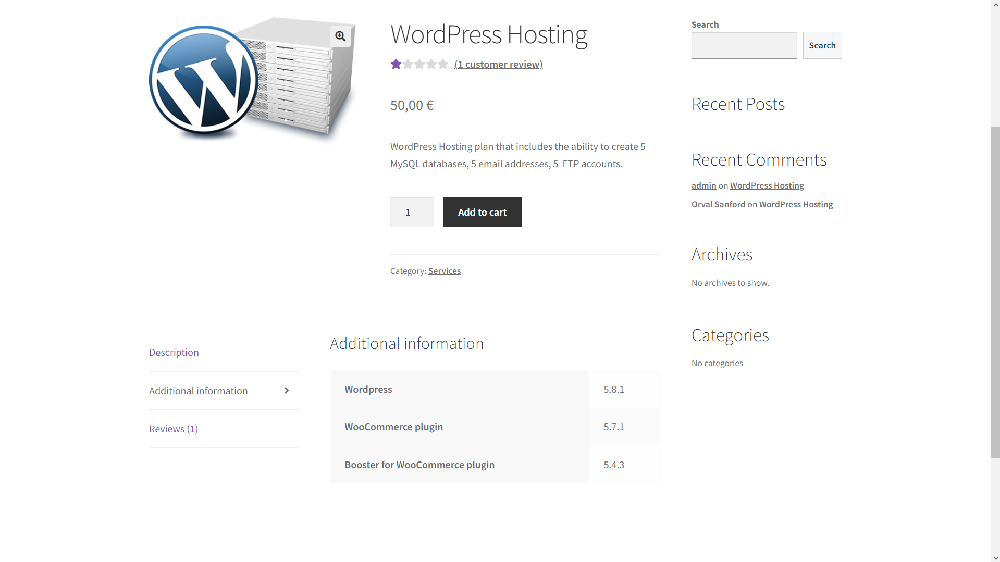
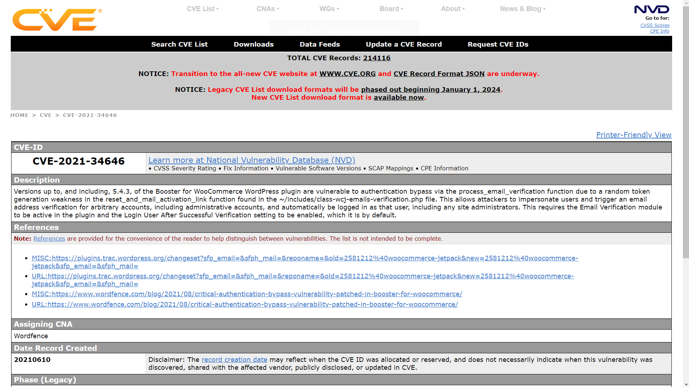
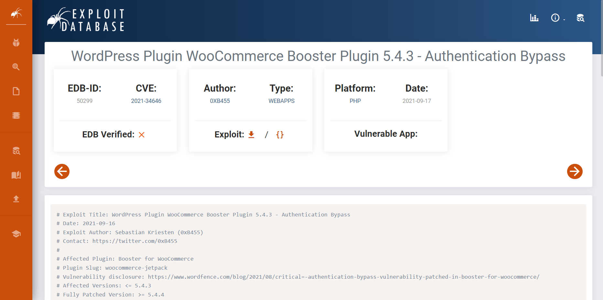
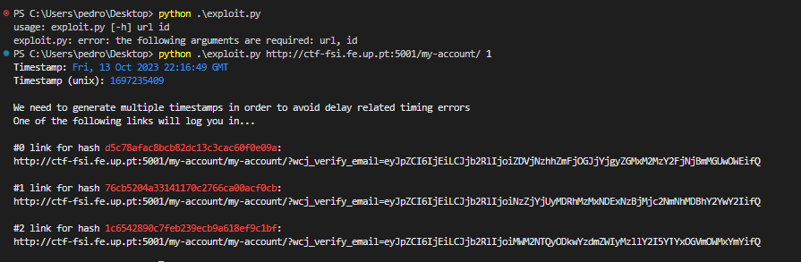
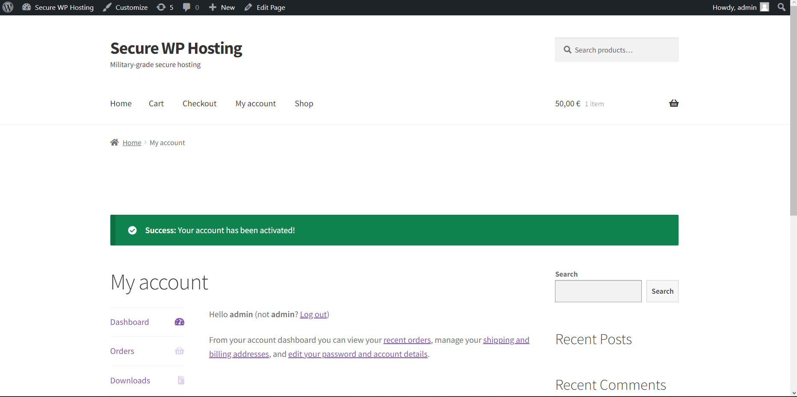
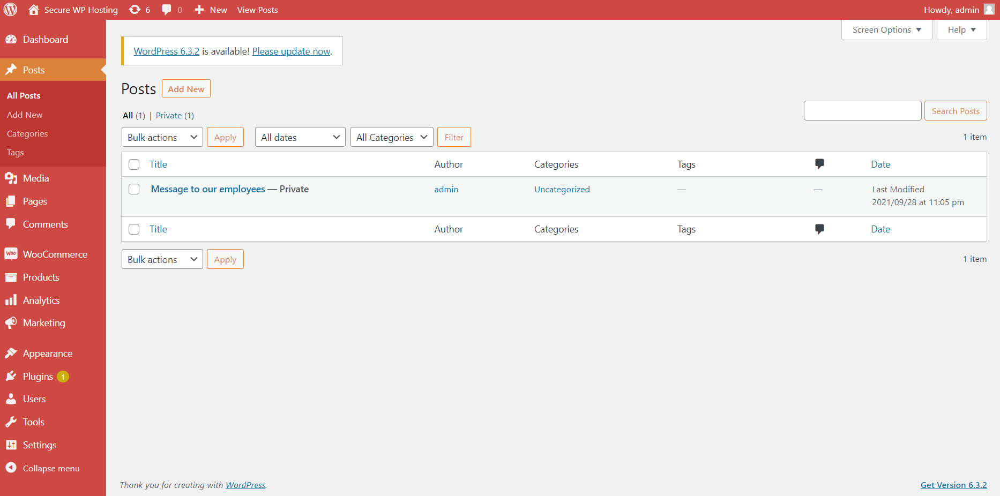
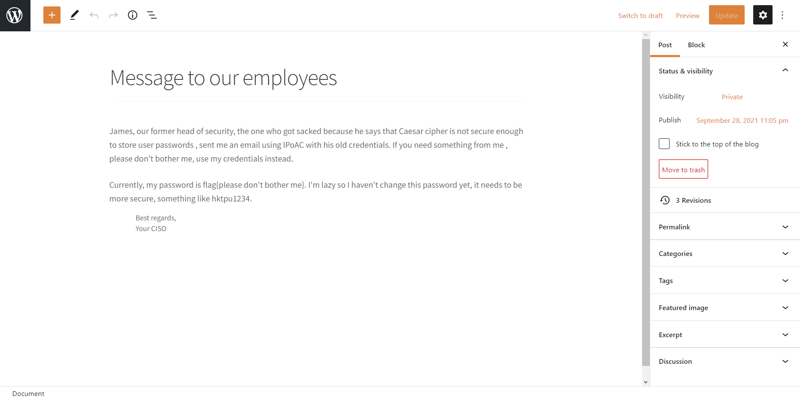

# CTF Semana #3 (Wordpress CVE)

## Descrição
Foi-nos fornecido um servidor wordpress, no qual o objetivo era encontrar a flag fazendo login como administrador e acedendo à sua área privada.

## Primeira parte - CVE
Inicialmente, tivemos de navegar pelo website na busca de informações úteis. Informações como versões do Wordpress, plugins instalados e respetivas versões, e até mesmo nomes de utilizadores, acabaram por ser as primeiras que tentámos procurar.

Como o objetivo era fazer login como administrador, a vulnerabilidade teria de ser, à partida, relacionada com a autenticação. Dado que, no website fornecido, não era possível registar, teríamos de arranjar forma de fazer login num utilizador existente com permissões de administrador.

Fomos pesquisando vulnerabilidades dessas versões do Wordpress e dos plugins utilizados, e a que encontrámos relacionada com a autenticação foi a `CVE-2021-34646`, que afeta as versões até 5.4.3 do plugin Booster for WooCommerce, a mesma que o servidor utiliza. 

Esta vulnerabilidade força a autenticação nos websites, através da função _process_email_verification_, gerando um token de autenticação aleatório. Isto permite que impersonássemos o administrador e saltar a parte de verificação de email, automaticamente entrando na sua conta.

Assim que submetemos o código da CVE, deu-se por concluída a primeira parte.

## Segunda parte - Flag
O objetivo era claro - aproveitarmo-nos da vulnerabilidade para entrar na conta do administrador. Um exemplo de exploit desta vulnerabilidade foi encontrado em https://www.exploit-db.com/exploits/50299.

O código que encontrámos utilizava 2 argumentos de consola - url do site e id do utilizador que queremos impersonar.

Como precisávamos de entrar na conta do administrador, supusemos que era o id número 1, mas caso contrário iríamos por tentativa e erro até o encontrarmos. Ao tentarmos o id 1, conseguimos fazer login como administrador. 

Ao entrarmos na sua área pessoal, encontrámos um post privado, entitulado "_Message to our employees_". Ao submetermos a flag que nele se encontrava, `please don't bother me`, deu-se por concluída a segunda parte, e o CTF por terminado.

